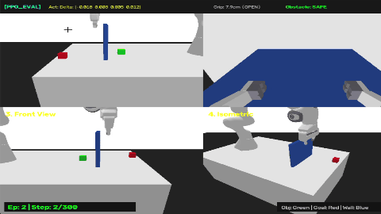

# 🤖 Franka Panda 7-DoF Pick-and-Place with Obstacle Avoidance

A hybrid Robot Learning pipeline combining **Flow Matching Imitation Learning** with **Residual PPO Reinforcement Learning** for high-precision 7-DoF Franka Panda pick-and-place task execution around a 24 cm obstacle partition wall.

---

## 📹 Demonstration Video



> **Note:** The robot plans 3D end-effector velocity & gripper actions using an enriched 34-dimensional wall-aware state vector, navigating over a 24 cm partition wall to place the block at table corner goals.

---

## 🤗 Hugging Face Models & Dataset Links

All trained checkpoints and dataset artifacts are available on the Hugging Face Hub:

| Asset | Description | Hugging Face Link |
| :--- | :--- | :--- |
| **Model Repository** | Full Hugging Face Model Hub | [swami93/franka_panda_7dof_policy](https://huggingface.co/swami93/franka_panda_7dof_policy) |
| **Base Flow Policy** | Flow Matching UNet Model (Master Epoch 5) | [`flow_policy_master_5.pt`](https://huggingface.co/swami93/franka_panda_7dof_policy/blob/main/checkpoints/flow_policy_master_5.pt) |
| **Residual PPO Policy** | Fine-tuned Residual PPO Model (Master Epoch 10) | [`residual_ppo_master_10.pt`](https://huggingface.co/swami93/franka_panda_7dof_policy/blob/main/checkpoints/residual_ppo_master_10.pt) |
| **LeRobot Dataset** | Demonstration Dataset (Parquet + Stats) | [swami93/franka_panda_pick_place](https://huggingface.co/datasets/swami93/franka_panda_pick_place) |

---

## 1. Setup & Installation

```powershell
# 1. Create a virtual environment (Python 3.10 recommended)
python -m venv venv

# 2. Activate virtual environment
# Windows PowerShell:
.\venv\Scripts\Activate.ps1
# Linux / macOS:
# source venv/bin/activate

# 3. Install dependencies
pip install -r requirements.txt
```

---

## 2. Downloading Pre-trained Models from Hugging Face

You can download the trained policy checkpoints directly from Hugging Face Hub using Python or `huggingface-cli`:

### Option A: Using Python script
```python
from huggingface_hub import hf_hub_download
import os

os.makedirs("checkpoints", exist_ok=True)

# Download Base Flow Matching policy
hf_hub_download(
    repo_id="swami93/franka_panda_7dof_policy",
    filename="checkpoints/flow_policy_master_5.pt",
    local_dir=".",
)

# Download Residual PPO policy
hf_hub_download(
    repo_id="swami93/franka_panda_7dof_policy",
    filename="checkpoints/residual_ppo_master_10.pt",
    local_dir=".",
)
```

### Option B: Using `huggingface-cli`
```powershell
huggingface-cli download swami93/franka_panda_7dof_policy checkpoints/flow_policy_master_5.pt --local-dir .
huggingface-cli download swami93/franka_panda_7dof_policy checkpoints/residual_ppo_master_10.pt --local-dir .
```

---

## 3. Evaluation Scripts & Running Inference

### Evaluating Residual PPO Policy (Recommended)

Run evaluation with full 3D PyBullet visualization:

```powershell
python ppo/eval_ppo.py --flow-checkpoint checkpoints/flow_policy_master_5.pt --ppo-checkpoint checkpoints/residual_ppo_master_10.pt --corners-only --near-obstacle --k-exec 1 --render
```

#### Command Line Options Explained:

| Option | Type | Default | Description |
| :--- | :---: | :---: | :--- |
| `--flow-checkpoint` | `str` | *Required* | Path to base Flow Matching checkpoint (`.pt`). Provides macro trajectory guidance. |
| `--ppo-checkpoint` | `str` | *Required* | Path to fine-tuned Residual PPO checkpoint (`.pt`). Applies corrective action offsets. |
| `--corners-only` | `flag` | `False` | Restricts target goal sampling strictly to table edge corners ($X \in [0.18, 0.225], Y \in [\pm 0.06, \pm 0.11]$). |
| `--near-obstacle` | `flag` | `False` | Spawns initial block position close to 24 cm wall partition ($X \in [-0.12, -0.09]$). |
| `--k-exec` | `int` | `1` | Receding Horizon Execution steps. **Use `1` for 100% closed-loop feedback at every step.** |
| `--episodes` | `int` | `10` | Number of evaluation test episodes to run. |
| `--render` | `flag` | `False` | Enables live 3D PyBullet window rendering with Multi-Camera dashboard overlay. |
| `--cpu` | `flag` | `False` | Force execution on CPU instead of CUDA GPU. |

---

### Evaluating Base Flow Policy Only

To evaluate pure Flow Matching without PPO residual corrections:

```powershell
python policy/eval_flow.py --checkpoint checkpoints/flow_policy_master_5.pt --corners-only --near-obstacle --k-exec 1 --render
```

---

## 4. System Architecture & Training

```
                     ┌──────────────────────────────┐
                     │ 34-D Wall-Aware State (s_t)  │
                     └──────────────┬───────────────┘
                                    │
           ┌────────────────────────┴────────────────────────┐
           ▼                                                 ▼
┌──────────────────────┐                         ┌───────────────────────┐
│  Flow Matching Policy│                         │   Residual PPO Actor  │
│  (1D CNN UNet)       │                         │   (MLP Policy)        │
└──────────┬───────────┘                         └───────────┬───────────┘
           │ a_base (Macro Trajectory)                       │ Delta_a (Precision Offset)
           └────────────────────────┬────────────────────────┘
                                    ▼
                         a_final = a_base + Delta_a
                                    │
                                    ▼
                         ┌──────────────────────┐
                         │ Franka Panda 7-DoF   │
                         │ PyBullet Environment │
                         └──────────────────────┘
```

1. **State Space (34-D)**: 
   Enriched state containing end-effector 3D position/velocity, gripper opening width, object 3D position/rotation/velocity, desired goal position, 3D relative displacement vectors ($\vec{v}_{\text{ee}\rightarrow\text{obj}}$, $\vec{v}_{\text{obj}\rightarrow\text{goal}}$, $\vec{v}_{\text{ee}\rightarrow\text{wall}}$), and scalar Euclidean distances.
2. **Action Space (4-D)**: 
   End-effector linear velocities ($\Delta X, \Delta Y, \Delta Z$) and continuous gripper finger actuation.
3. **Reward Function**: 
   Distance progress tracking, symmetric goal progress, +15 lift bonus, -20 PyBullet contact wall collision penalty, and +150 task success completion bonus.

---

## 5. Teleoperation Data Collection

To gather custom human demonstration data in PyBullet:

```powershell
python main.py --mode MANUAL --corners-only --near-obstacle --save-dir data/raw_all
```

### Dashboard Controls:

| Key | Action |
| :---: | :--- |
| **W / S** | Move End-Effector Forward / Backward ($\pm X$) |
| **A / D** | Move End-Effector Left / Right ($\pm Y$) |
| **E / Q** | Move End-Effector Up / Down ($\pm Z$) |
| **O / C** | Open / Close Gripper (continuous squeeze lock) |
| **SPACE** | Hold Position (zero action) |
| **B / T** | **Start / Pause Recording** (Toggle) |
| **ENTER** | **Save Demonstration Episode** |
| **R** | **Reset Episode** (discards unsaved buffer) |
| **ESC** | **Exit Simulation** |

---

## 6. Converting Data to LeRobot Format

Convert gathered `.npz` demonstrations into LeRobot Apache Parquet format:

```powershell
python convert_to_lerobot.py --input data/raw_all --output data/lerobot_all
```

---

## 📜 License

Distributed under the MIT License. See `LICENSE` for more information.
